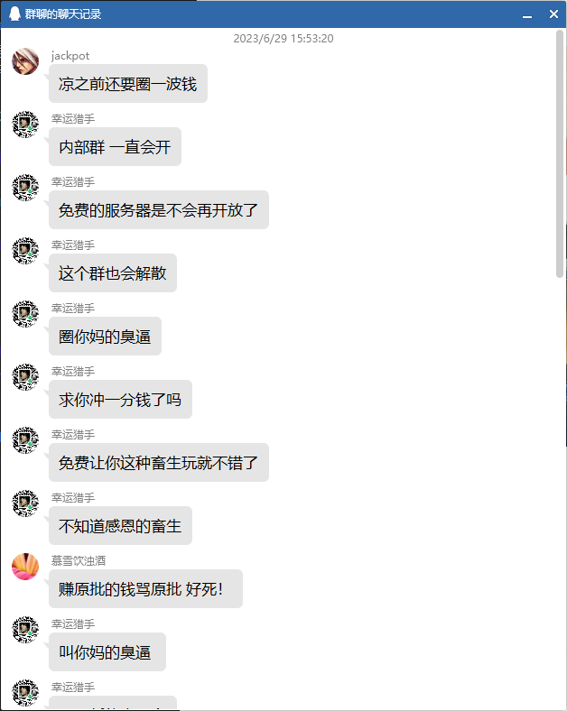
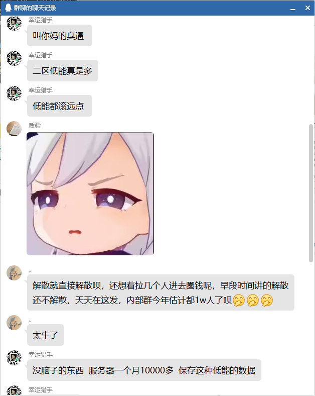
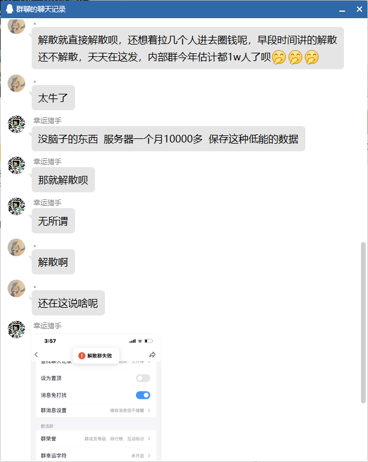
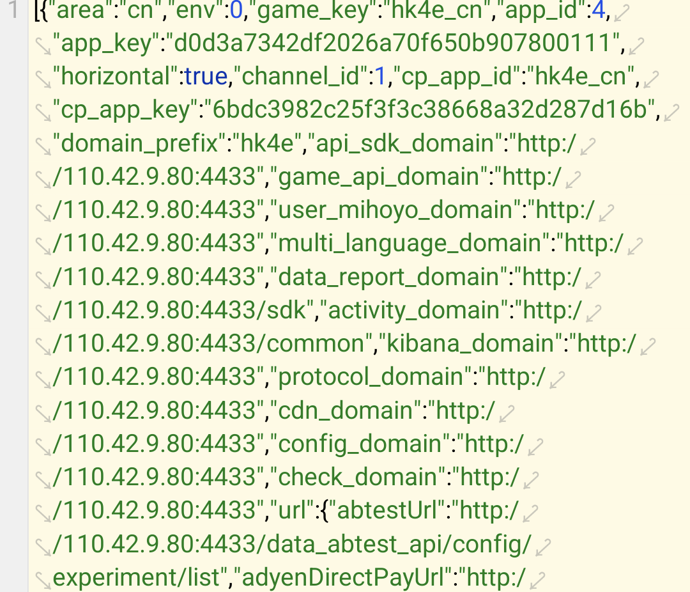
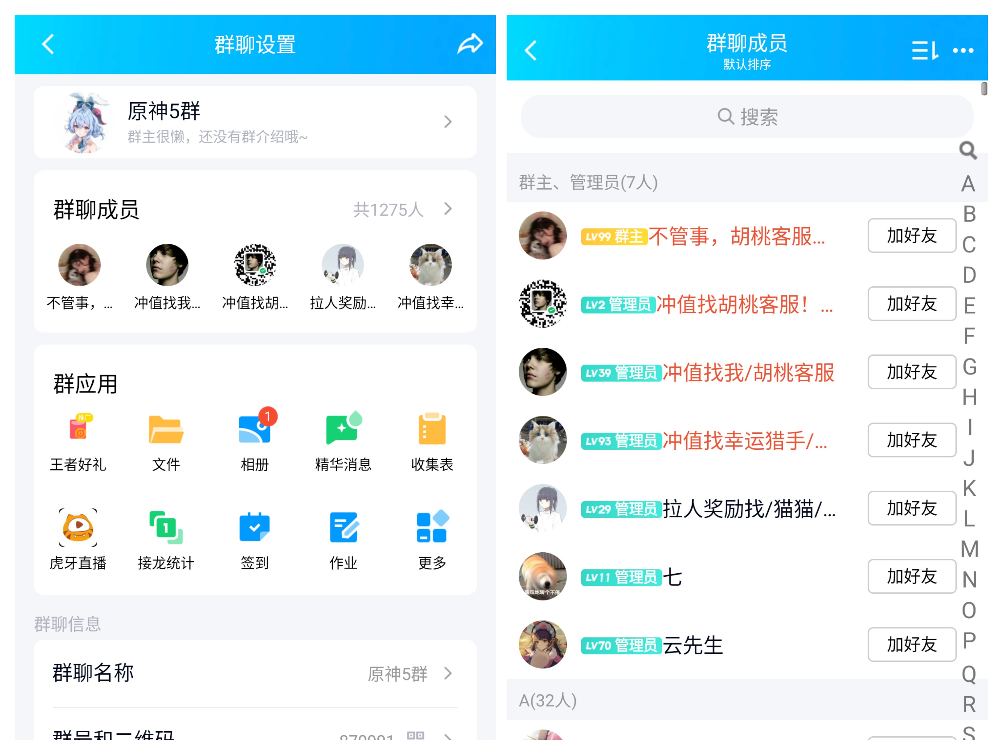
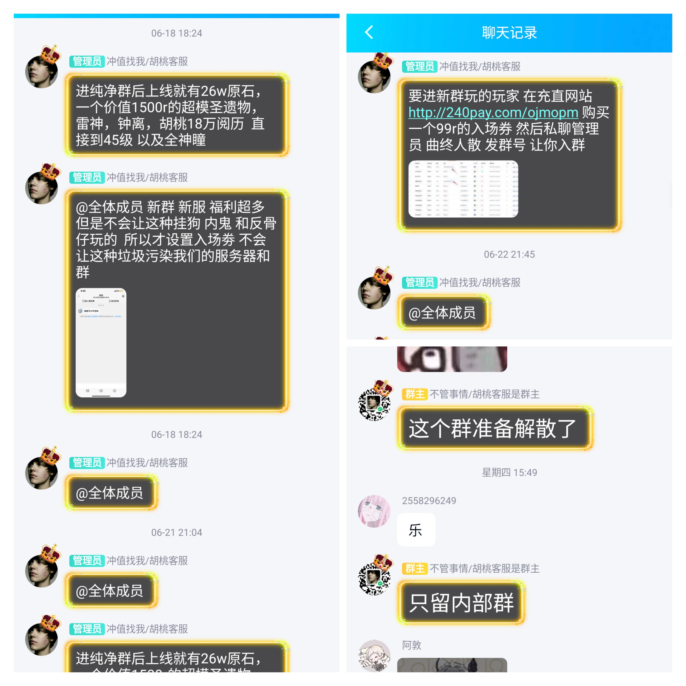
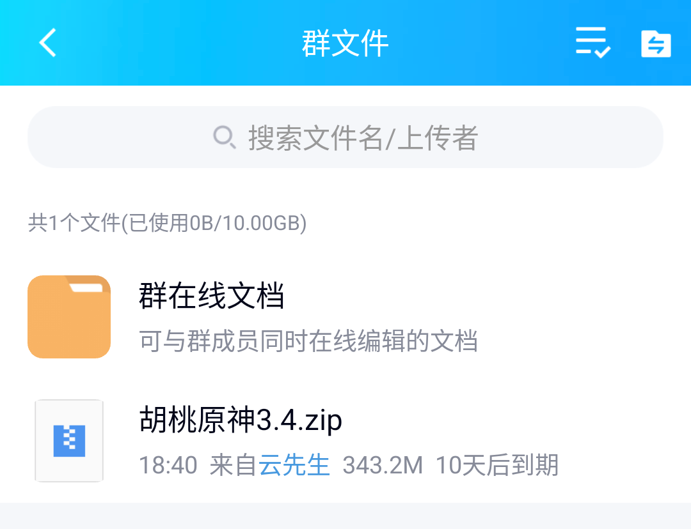
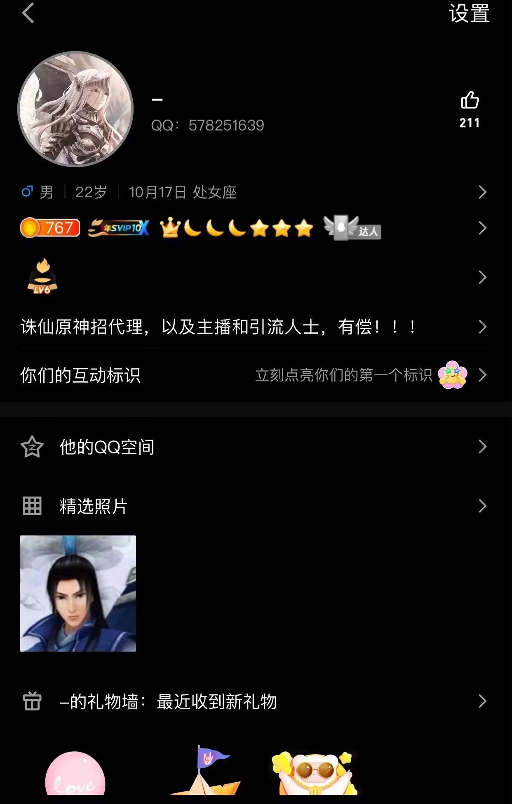

# Private servers that seriously violate the agreement:
According to the information provided by relevant parties, a Genshin Impact private server from mainland China, named: “Zhu Xian Hu Tao”, server address: http://110.42.9.80:4433 is conducting illegal fundraising activities, namely forcing the sale of private server items through a third-party card secret platform. According to the available data, the amount of money involved is huge. In view of this situation, we will have to stop updating this repository until this illegal and criminal activity stops.

# 严重不守约定的私人服务器：
据有关人士提供的资料显示，一个来自中国大陆的原神私人服务器,名称为：“诛仙胡桃”，服务器地址为：http://110.42.9.80:4433 在进行非法集资活动即强制性以第三方卡密平台售卖私人服务器内物品，据已有资料显示，涉及资金数额巨大，介于此情况的发生，我们将不得不停止此储存库的更新，直到此违法犯罪活动停止

# 以下是有关人士提供的资源：

# The following are the resources provided by relevant parties:

# 有关人士提供诛仙所有群组负责人：

# Relevant parties provide the person in charge of all Zhu Xian groups:

# Disclaimer: The provision of the above pictures and text materials has nothing to do with this repository and the repository staff. This repository is only for recording. Conversely, any impact on the normal social order caused by any server using this repository and related files has nothing to do with this repository. This repository is only for technical exchange.

# 免责声明：以上图片及文字资料的提供与本储存库及储存库人员无任何关系，本储存库仅做记录。相对的，任何服务器使用本储存库及相关文件造成的任何对社会正常秩序的影响也与此储存库无关，本储存库仅在于技术交流
# Anime Game APK Proxy
This code source is from [577fkj](https://github.com/577fkj) ,which is currently source code has been closed since version 1.7 because they don't want people to use this app for buying private server accounts. here I am just fixing the code so that it can be supported with version 2.8 including being able to login to a custom server without having to use a modified apk made in China which only allows using their server.

## Bug (Need your help)
I've done some testing on several phones mine have it all working without problems. it's just that some other players still often get the error message "Failed to Extract il2cpp" which I can't fix because I don't have a phone that has the same error. so i need you guys to fix this :)

## Do not do this
Please don't use this app to sell private server accounts, or any other weird thing because it's supposed to be free. If I find someone selling private server accounts I'll probably be shut down forever.